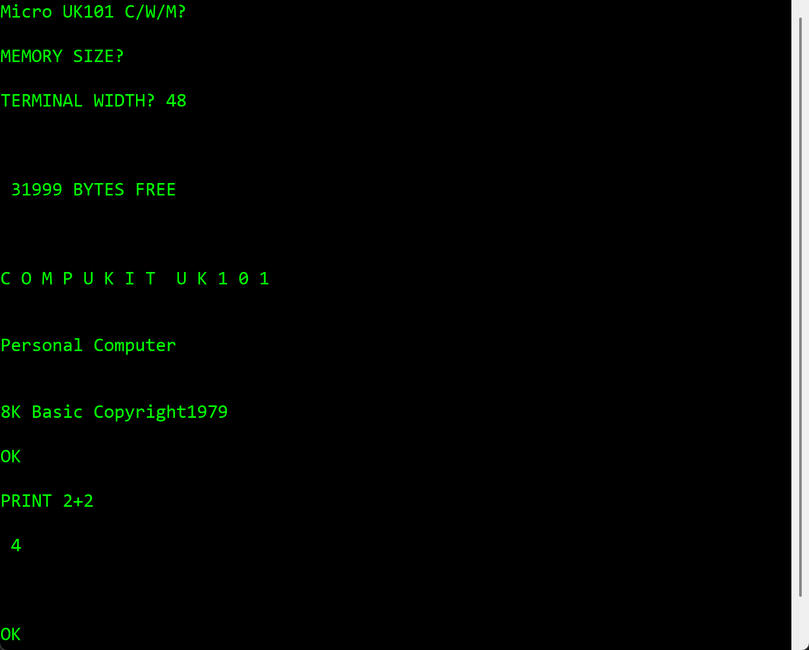

# UK101Emu

A software emulator of the **Compukit UK101** — a single-board 6502 home computer from 1979, designed by Science of Cambridge Ltd and sold as a kit in the UK. It came with the CEGMON monitor ROM and Microsoft BASIC, letting users write and run BASIC programs via a serial terminal interface.

This emulator recreates the experience in a Windows desktop application.



## Features

- **Full MOS 6502 CPU** — all official opcodes and addressing modes
- **CEGMON monitor ROM** — the original machine-language monitor with C/W/M commands
- **Microsoft BASIC** — the 8K BASIC interpreter, loaded from ROM
- **ACIA 6850 serial I/O** — memory-mapped keyboard input and terminal output
- **Cycle-accurate timing** — `Stopwatch`-based throttling targeting 1 MHz clock speed
- **Terminal display** — green-on-black console, just like the original

## Architecture

```
┌─────────────────────────────────────────────┐
│  TerminalForm.vb                            │
│  WinForms UI — RichTextBox terminal,        │
│  keyboard input, CPU thread management      │
├─────────────────────────────────────────────┤
│  Cpu6502.vb          │  CpuStep.vb          │
│  Registers & flags   │  Instruction decode   │
│  A, X, Y, SP, PC     │  & execute (Select    │
│  C, Z, I, D, B, V, N │  Case on opcode)      │
├─────────────────────────────────────────────┤
│  Memory.vb                                  │
│  64 KB address space with memory-mapped I/O │
│  $0000–$7FFF  RAM (32 KB)                   │
│  $8000–$FFFF  ROM (CEGMON + BASIC)          │
│  $F000        ACIA status register          │
│  $F001        ACIA data register            │
└─────────────────────────────────────────────┘
```

| File | Purpose |
|------|---------|
| `Cpu6502.vb` | CPU registers, flags and reset logic |
| `CpuStep.vb` | Single-instruction step — decodes opcode, executes, updates state |
| `Memory.vb` | 64 KB byte array, ROM write-protection, ACIA 6850 emulation |
| `TerminalForm.vb` | WinForms UI, CPU background thread with 1 MHz timing |
| `all.rom` | 32 KB ROM image loaded at `$8000` (CEGMON + Microsoft BASIC) |

## Memory Map

| Address | Content |
|---------|---------|
| `$0000–$7FFF` | RAM (32 KB) |
| `$8000–$9FFF` | Microsoft BASIC |
| `$A000–$BFFF` | (unused ROM space) |
| `$F000` | ACIA 6850 status register (read) / control register (write) |
| `$F001` | ACIA 6850 data register (read = keyboard, write = terminal) |
| `$FC00–$FFFF` | CEGMON monitor ROM, including reset vector |

## ACIA 6850 Emulation

The UK101 uses a Motorola 6850 ACIA for serial communication. The emulator maps it as:

**Status register (`$F000` read):**
- Bit 0 — Receive Data Ready (1 = key pressed)
- Bit 1 — Transmit Data Ready (always 1)

**Data register (`$F001`):**
- Read — returns the last key pressed (7-bit ASCII), clears ready flag
- Write — sends character to the terminal display

## Requirements

- **Windows** (Windows Forms)
- **.NET 8.0** or later
- **Visual Studio 2022** (17.x) or the .NET 8 SDK

## Build & Run

```bash
# Clone
git clone https://github.com/yourusername/uk101emu.git
cd uk101emu

# Build
dotnet build

# Run
dotnet run --project UK101Emu
```

Or open `UK101Emu.slnx` in Visual Studio and press F5.

## Usage

When the emulator starts, the CEGMON monitor displays:

```
Micro UK101 C/W/M?
```

| Command | Action |
|---------|--------|
| **C** | Cold start — enter Microsoft BASIC |
| **W** | Warm start — return to BASIC (preserves program) |
| **M** | Machine-code monitor |

### BASIC Example

```
C                          ← cold start
MEMORY SIZE? ↵             ← press Enter for default
WIDTH? 48 ↵

OK
10 PRINT "HELLO WORLD"
20 GOTO 10
RUN
```

## CPU Implementation

All 56 official 6502 instructions are implemented across all addressing modes:

- **Load/Store:** LDA, LDX, LDY, STA, STX, STY
- **Arithmetic:** ADC, SBC, INC, DEC, INX, INY, DEX, DEY
- **Logic:** AND, ORA, EOR, BIT
- **Shift/Rotate:** ASL, LSR, ROL, ROR
- **Compare:** CMP, CPX, CPY
- **Branch:** BCC, BCS, BEQ, BNE, BMI, BPL, BVC, BVS
- **Jump/Call:** JMP, JSR, RTS, RTI, BRK
- **Stack:** PHA, PLA, PHP, PLP
- **Transfer:** TAX, TAY, TXA, TYA, TSX, TXS
- **Flags:** CLC, SEC, CLI, SEI, CLV, CLD, SED
- **Other:** NOP

The indirect JMP (`$6C`) correctly emulates the 6502 page-boundary bug.

## ROM

The file `all.rom` is a 32 KB binary image containing CEGMON and Microsoft BASIC, loaded at address `$8000` on startup. The first 8 KB is the original Microsoft BASIC, and the last 2 KB is the CEGMON monitor ROM (with reset vector at `$FFFC–$FFFD`).

The ROM image is sourced from [Grant Searle's UK101 project](http://searle.x10host.com/uk101/uk101.html). Grant's version includes a patched CEGMON that replaces the original keyboard/screen routines with serial ACIA I/O, making it suitable for terminal-based operation — which is exactly how this emulator works.

> **Note:** The ROM image is included for educational and preservation purposes. CEGMON and Microsoft BASIC are historically significant software from 1979.

## License

MIT

## Acknowledgements

- **[Grant Searle](http://searle.x10host.com/uk101/uk101.html)** — patched CEGMON ROM and combined ROM image used in this emulator
- **Science of Cambridge** — original UK101 hardware design (1979)
- **Ohio Scientific** — the Superboard II, on which the UK101 was based
- **CEGMON** — the monitor ROM by Compukit/UK101 community (D/C/W/M)
- **Microsoft** — the 8K BASIC interpreter by Bill Gates, Paul Allen and Monte Davidoff
